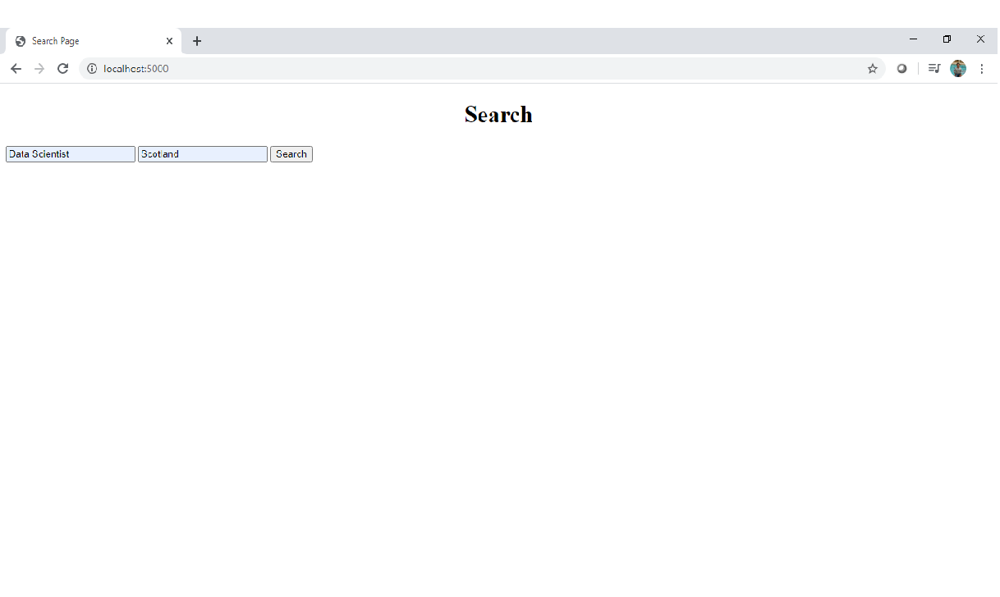
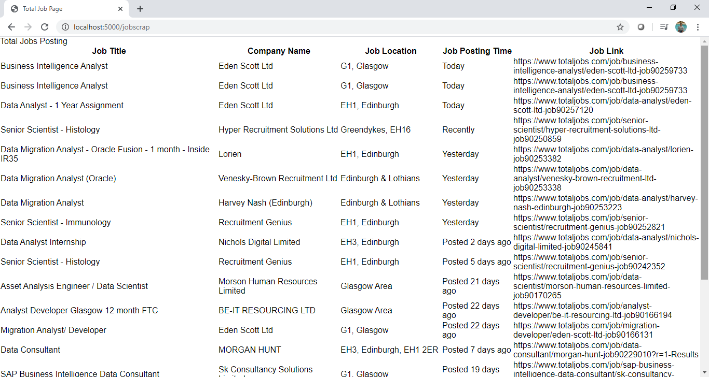

# Project JobScrapping:
The main objective of this project is to scrap jobs from [Total Jobs](https://www.totaljobs.com/), based on the position and location.
- ## Programming Language:
  - Python
  - Libraries
    - Flask
    - BeautifulSoup4
    - Selenium
    - os
    - webdriver
  - HTML5
  - CSS3
 
- ## Deployment:
 
 Cloud: **Heroku**
 
 Website Link: [JobScrapper](https://desolate-meadow-45092.herokuapp.com/)
 **Note:** Above link is only available for a limited period as this is deployed onto a free-tier Heroku cloud on an experimental basis. 
 
- ## CheckPoints while Deploying Selenium into Cloud:
 In order to proceed with the deployment of selenium web app into heroku cloud, I have taken references from the below:
  - [Medium](https://medium.com/@mikelcbrowne/running-chromedriver-with-python-selenium-on-heroku-acc1566d161c)
 Please don't follow step 1 build pack links as they are no longer available. Go to the available stackoverflow link given there.
  - [YouTube](https://www.youtube.com/watch?v=Ven-pqwk3ec&t=305s)
 
  After deploying the application into Heroku, i have observed that because of security protocol it is not allowing to scrap the webpage. But the same is working fine from local machine using local host.
 
 Below given are the screen shots from the testing of code on Local Machine:
 
 - ## Home Page:
 
 
  - ## Result Page:
  
 
